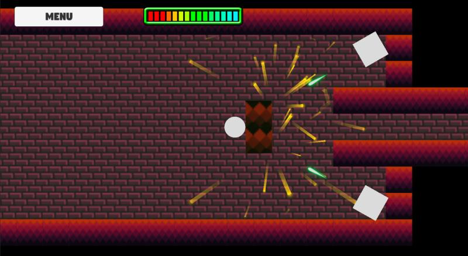
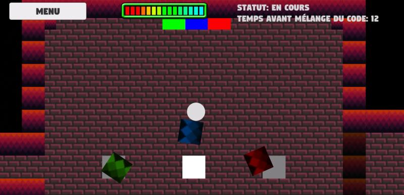

# Un jeu formidable (Le jeu) #
Ce projet a été réalisé dans le contexte de mon cours de Jeux 3 à l'aide Unity en utilisant le langage C#. Pour celui-ci, il nous était demandé de créer un petit jeu comportant trois salles distinctes: une salle d'obstacles, une salle de puzzle et une salle de boss à la fin. Pour rendre ce projet un peu plus intéressant, j'ai décidé de centrer mon jeu sur l'utilisation de la physique pour surmonter les différentes salles. Par exemple, le joueur se voit demandé de pousser un petit mur pour se protéger de tirs de tourelles dans la première salle et celui-ci peut déplacer la salle dans laquelle le combat final se déroule. Pour ce projet, j'ai dû programmer le tracking du joueur par les tourelles et le boss, gérer des effets de particules pour, entre autres, les tirs des tourelles et du joueur, utiliser des tilemaps, programmer le puzzle et son rafraichissement s'il n'est pas complété assez rapidement, etc. Bref, un petit projet sympathique m'ayant permis d'explorer différentes fonctionnalités de Unity.

### Images du projet ###
#### Salle 1: Obstacles ####

#### Salle 2: Puzzle ####

#### Boss ####
.jpg>)

### Ce repositoire contient tous les fichiers du projet Unity. ###
* Un jeu formidable (Le jeu) est un jeu de puzzle produit dans le cadre du cours Jeu vidéo 3 au Cégep de Saint-Jérôme (A2023).

### Version de Unity ###
* Ce projet a été conçu pour la version 2022.3.17 de Unity.

### Contact ###
* https://tim-cstj.ca/